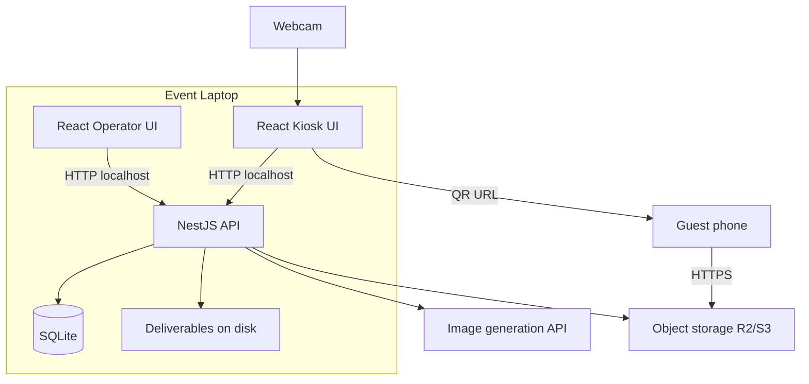
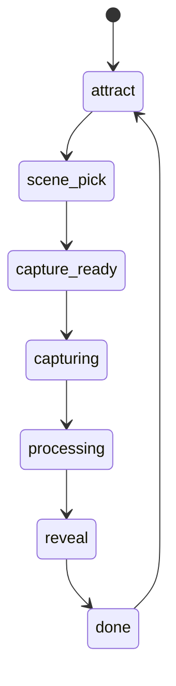

# Cabine IA — MVP Architecture

**Status:** Draft for implementation planning  
**Last updated:** 2026-05-29  
**Product source of truth:** [PROJECT_DEFINITION.md](./PROJECT_DEFINITION.md)

This document describes *how* the MVP is built at a high level. User stories, epics, and tasks should trace back here, to the product definition (especially §10 and §16), and to [MVP_EPIC_ROADMAP.md](./MVP_EPIC_ROADMAP.md) for vertical implementation epics.

---

## 1. Purpose

Cabine IA is a laptop-based AI photobooth: operator manages **events** (grouping guest sessions and archive) and picks a **theme** independently from installed packs; guest picks a **scene**, system captures faces, generates a cartoon **deliverable**, and guest receives it via **QR code**. Operator can **download all generated images** per event after the run.

---

## 2. Architecture principles

| Principle | Choice |
|-----------|--------|
| **State ownership** | NestJS is the single source of truth for booth and session state |
| **Frontend role** | React renders API snapshots and sends commands — no shared domain logic with backend |
| **Deployment** | Single laptop (macOS first); Chromium kiosk + local NestJS on `127.0.0.1` |
| **Guest download** | Public HTTPS URLs (object storage presigned links) — guests are **not** on booth LAN |
| **Operator archive** | SQLite + local filesystem; downloads via operator UI until event is deleted |
| **Secrets** | API keys and cloud credentials only in NestJS — never in the React bundle |
| **Folder boundary** | **All backend** in `api/`; **all frontend** in `kiosk/`; **no shared code** between them. Only repo-level `scripts/` and `docs/` sit outside those trees |

---

## 3. System context



**Outbound internet required** on the laptop (generation API + upload for guest QR).

---

## 4. Repository layout and folder boundary

**Rule:** Backend and frontend are fully separated. They communicate **only over HTTP** on localhost. No monorepo packages, no shared TypeScript modules, no shared `types/` folder.

```
cabine-ia/
  api/              # Everything backend (NestJS)
  kiosk/            # Everything frontend (React + Vite)
  scripts/          # Shared: booth startup, dev orchestration
  docs/             # Shared: architecture, specs, runbooks
  PROJECT_DEFINITION.md
```

### `api/` — backend only

All NestJS code, plus backend-owned assets and runtime data:

```
api/
  src/              # modules, controllers, services, domain logic
  themes/           # theme packs (read at runtime; prompts never exposed to kiosk)
  data/             # SQLite + deliverables + tmp (gitignored)
  prisma/           # or typeorm migrations (TBD)
  package.json
```

Includes: session FSM, jobs, generation client, R2 delivery, SQLite, operator download endpoints, theme loading.

### `kiosk/` — frontend only

All React code and frontend assets:

```
kiosk/
  src/              # components, pages, hooks, API client (fetch wrappers)
  public/
  package.json
```

Includes: guest flow, operator panel, downloads UI, camera, face detection, QR display. API response types are defined **inside kiosk** (or generated into `kiosk/src/` from OpenAPI — still not a shared folder).

### Allowed outside `api/` and `kiosk/`

| Path | Role |
|------|------|
| **scripts/** | Start API + kiosk + Chromium kiosk mode |
| **docs/** | Architecture and product docs |
| **PROJECT_DEFINITION.md** | Product definition (root) |

### Not allowed

- `packages/` or any shared library imported by both apps
- Cross-imports between `api/` and `kiosk/`
- Putting business logic in `scripts/` (scripts only orchestrate processes)

| App | Responsibility |
|-----|----------------|
| **kiosk/** | Fullscreen guest flow; operator panel + downloads; camera; face detection; QR display |
| **api/** | Booth state, jobs, themes, generation, delivery, persistence, file/ZIP downloads |

**Stack:** TypeScript in both apps (separate `package.json` each). NestJS, React + Vite, SQLite (Prisma or TypeORM TBD), Cloudflare R2 via S3 SDK.

**Out of scope for MVP:** Tauri/Rust, Electron (optional later), programmatic WhatsApp/SMS/email, cloud gallery, multi-booth sync.

---

## 5. Guest flow (server-driven phases)

React chooses which screen to show from the API `phase` field — no parallel client state machine.



**High-level steps:** attract → pick scene → capture (1–4 faces) → process → reveal + QR → post-finish timer → attract.

During `processing`, kiosk polls (or SSE — TBD) until phase changes.

**Phase ownership:** `GET /booth` exposes a single `phase` field for the kiosk. It is **not** stored on `BoothConfig`. Idle (`attract`) means no current session; once the guest taps Começar, `Session.phase` drives the screen until the session ends. Implement via `resolveBoothPhase(currentSession)` in the API (`session?.phase ?? 'attract'`). Operator pause (V5) uses a `BoothConfig.paused` flag—not a duplicate phase column.

---

## 6. Data and retention

### Entity model

| Entity | Storage | Notes |
|--------|---------|-------|
| **Event** | SQLite | `id`, `name`, timestamps; operator-created; groups sessions and deliverables |
| **BoothConfig** | SQLite | Operator config: `activeEventId`, `activeThemeId`, countdown settings; optional `paused` (V5). **No guest phase** |
| **Session** | SQLite | Guest journey state (`phase`, `sceneId`, …); `eventId` FK at `POST /sessions/start` |
| **Theme pack** | `api/themes/<themeId>/` on disk | **Global**, not under event folders; prompts server-only |
| **Deliverable** | `api/data/events/{eventId}/deliverables/` | Final cartoon images per session |

**Theme vs event:** Theme packs are installed assets shared across events. Selecting a theme updates booth config only—it does not create, own, or scope events.

**Boot seed:** On first API start with an empty database, seed one default event and set it as `activeEventId` so dev and party pilot work without manual setup.

| Store | Contents | Retention |
|-------|----------|-----------|
| **SQLite** | Events, sessions, booth config, file paths, metadata | Until operator deletes event |
| **Filesystem** `api/data/events/{eventId}/deliverables/` | Final cartoon images | Until operator deletes event |
| **`api/data/tmp/`** | Raw captures, crops, intermediates | Delete after job completes |
| **R2** | Copy for guest QR download | Short TTL (15–60 min presigned URL) |

**Privacy:** Guests never receive raw photos. Operator downloads are stylized deliverables only.

---

## 7. Delivery

**Guests:** After generation, Nest uploads to private object storage, returns presigned HTTPS URL, kiosk displays QR. Phone downloads on cellular or any Wi‑Fi.

**Operator:** `/operator/downloads` lists session images; download one file or ZIP of all for the event. Sharing (e.g. WhatsApp) happens **outside** the app.

**Fallback:** Full-screen reveal for screenshot; optional AirDrop (runbook).

---

## 8. Theme packs

Versioned on-disk packs under `api/themes/<themeId>/`: manifest, style preset, 3 scenes each with example image, display name (pt-BR), prompts (server-only), composition templates. **Not stored per event**—the same packs are available regardless of which event is active. Kiosk receives scene metadata via API only (names, example image URLs served by Nest).

Details → future [THEME_PACK_SPEC.md](./THEME_PACK_SPEC.md).

---

## 9. API surface (sketch)

All routes on `127.0.0.1` only for MVP. Exact DTOs defined during implementation.

**Booth / guest**

- `GET /booth` — snapshot: **phase** (derived from current session or `attract`), active **event** (id + name), active theme, scenes for picker, config, current session fields
- `POST /sessions/start` — creates session under **active event**
- `POST /sessions/current/scene`
- `POST /sessions/current/capture` — body: face crops from kiosk
- `GET /sessions/current` — poll during processing

**Operator**

- `GET /operator/events` — list events (id, name, timestamps, session count optional)
- `POST /operator/events` `{ name }` — create event (does not auto-activate)
- `POST /operator/events/:id/activate` — set active event (409 if guest session in progress; same guard as theme change)
- `POST /operator/theme`, countdown config, pause, retake, skip
- `GET /operator/themes` — list installed theme packs (no prompts)
- `GET /operator/events/:eventId/sessions` — list for downloads UI
- `GET /operator/events/:eventId/sessions/:id/download`
- `GET /operator/events/:eventId/export.zip`
- `DELETE /operator/events/:id`

---

## 10. Deviations from product definition

| PRODUCT_DEFINITION.md | Architecture choice |
|-----------------------|---------------------|
| §8 LAN-served QR links | Public HTTPS via R2 presigned URLs |
| §9 ephemeral-only by default | Operator opt-in retention: deliverables kept until event deleted |
| §8 WhatsApp delivery later | Operator download section only; no messaging integration |
| Boot default event | Auto-seed one event + set active when DB empty (product §5 Event) |

---

## 11. Non-functional targets

Mapped from product §11: ~30–45s processing perceived wait, retry once on generation failure, single concurrent job (pilot), health check at setup, Portuguese UI, 4:5 output, 1–4 faces.

---

## 12. Open decisions (next iteration)

| Topic | Notes |
|-------|--------|
| Image API vendor | Abstract behind `GenerationProvider` |
| Compositor | Full scene from API vs `sharp` + scene templates |
| Guest QR | Direct presigned URL vs hosted download page |
| Processing updates | Polling vs SSE |
| ORM | Prisma vs TypeORM |

---

## 13. Related documents

| Document | Purpose |
|----------|---------|
| [PROJECT_DEFINITION.md](./PROJECT_DEFINITION.md) | Product scope and locked MVP decisions |
| [MVP_EPIC_ROADMAP.md](./MVP_EPIC_ROADMAP.md) | Vertical implementation epics (V0–V8) for task breakdown |
| THEME_PACK_SPEC.md | Theme/scene authoring (planned) |
| OPERATOR_RUNBOOK.md | Setup, network, lighting, troubleshooting (planned) |

---

## Document history

| Date | Change |
|------|--------|
| 2026-05-28 | Initial MVP architecture (high level) |
| 2026-05-28 | Locked folder boundary: `api/` vs `kiosk/`; only `scripts/` and `docs/` shared |
| 2026-05-29 | Operator event model: entity table, list/create/activate API, theme independence |
