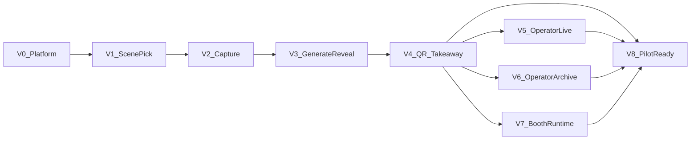

# Cabine IA — MVP Epic Roadmap (vertical slices)

**Status:** Approved for implementation planning  
**Last updated:** 2026-05-28  
**Product source of truth:** [PROJECT_DEFINITION.md](./PROJECT_DEFINITION.md) (especially §10 and §16)  
**Architecture source of truth:** [ARCHITECTURE.md](./ARCHITECTURE.md)

Epics are **vertical**: each one delivers a **demoable outcome** across `api/` and `kiosk/`, adding only the persistence, endpoints, and UI required for that slice. Avoid finishing “all backend” or “all kiosk” before anything works end-to-end.

**Deviations to remember when tasking:**

- Guest QR → **R2 presigned HTTPS** (not LAN) — [ARCHITECTURE.md](./ARCHITECTURE.md) §10.
- Operator archive → **kept until event delete** — [ARCHITECTURE.md](./ARCHITECTURE.md) §6.

After **V4**, the guest happy path is complete. **V5–V7** can run in parallel; **V8** hardens content and ops for the party pilot.

---

## How vertical epics differ from horizontal layering

| Horizontal (avoid) | Vertical (this plan) |
|--------------------|----------------------|
| “Build all SQLite entities” | Persist **session + sceneId** when scene pick ships (V1) |
| “Build full FSM + all routes” | Add **phase transitions** only for the journey step in flight |
| “Build all kiosk screens” | Ship **screens for phases this epic touches** |
| “Polish Portuguese in a late epic” | **PT copy ships with the screen** in that epic |

Cross-cutting concerns (logging, OpenAPI types, secrets) are **tasks inside each epic**, not separate epics.

---

## V0 — Platform slice: booth boots and shows attract

**Detailed spec:** [docs/epics/V0_PLATFORM.md](./epics/V0_PLATFORM.md) · **Branch:** `feature/v0-platform`

**User outcome:** Laptop runs API + kiosk; guest sees idle attract screen driven by server state.

**Vertical deliverables:**

| Layer | Scope |
|-------|--------|
| **api/** | NestJS scaffold; `GET /booth` returning `{ phase: "attract", ... }`; health/ping; bind `127.0.0.1` |
| **kiosk/** | Vite + React scaffold; poll `GET /booth`; fullscreen **Attract** screen (PT placeholder OK) |
| **scripts/** | Dev: start api + kiosk together |
| **data/** | Minimal or in-memory booth state OK; introduce SQLite when V1 needs it |

**Demo:** `npm run dev` → kiosk shows “Faça seu retrato cartoon” (or similar) while API reports `attract`.

**Maps to:** Architecture §4; product §6 step 1 (shell).

**Notes:** SQLite and **Começar** button deferred to V1. Tasks are incremental and TDD-driven — see epic spec for full list.

| Phase | Task IDs | Summary |
|-------|----------|---------|
| A Setup | V0-00 – V0-03 | Branch, epic spec, roadmap link, `.gitignore` |
| B API | V0-10 – V0-14 | NestJS, health, booth snapshot, CORS |
| C Kiosk | V0-20 – V0-26 | Vite/React, polling, PhaseRouter, Attract screen |
| D Scripts | V0-30 – V0-31 | `npm run dev` orchestration |
| E Sign-off | V0-40 – V0-41 | Manual demo + DoD |

---

## V1 — Scene selection slice: operator theme, guest picks scene

**Detailed spec:** [docs/epics/V1_SCENE_PICK.md](./epics/V1_SCENE_PICK.md) · **Branch:** `feature/v1-scene-pick`

**User outcome:** Operator selects active theme; guest taps Começar → sees **3 scene cards** (example + name) → picks one → lands on **“Tirar foto”** ready state; can go back and change scene.

**Vertical deliverables:**

| Layer | Scope |
|-------|--------|
| **api/** | Theme pack loader + **one stub theme** under `api/themes/`; phases `attract` → `scene_pick` → `capture_ready`; `POST /sessions/start`, `POST /sessions/current/scene`; `POST /operator/theme`; `GET /booth` includes scene metadata + example image URLs (prompts **never** in response) |
| **kiosk/** | Attract (Começar), ScenePicker, CaptureReady shells; operator entry to theme list |
| **persistence** | Event + booth config (active `themeId`) + session (`sceneId`) — first real SQLite migration |
| **docs** | Start `THEME_PACK_SPEC.md` if authoring begins |

**Demo:** Switch theme in operator UI → guest sees different 3 scenes → select scene → capture-ready with correct scene name.

**Maps to:** Product §5 Theme/Scene, §6 steps 2–3, §7 pre-event theme, §16 static examples; §10 operator theme + scene picker.

**Depends on:** V0.

**Notes:** Operator-only auth (PIN → JWT) ships in V1 — guest routes stay public; `/operator/*` protected. Resolves theme-selection access before V5 live controls. Tasks are incremental and TDD-driven — see epic spec for full list.

| Phase | Task IDs | Summary |
|-------|----------|---------|
| A Setup | V1-00 – V1-02 | Branch, epic spec, roadmap link, env vars |
| B Auth | V1-10 – V1-13 | Operator PIN login, JWT guard, kiosk auth hook |
| C Persistence | V1-20 – V1-22 | Prisma, SQLite, event boot seed |
| D Themes | V1-30 – V1-33 | Theme pack spec, stub packs, example URLs |
| E FSM | V1-40 – V1-44 | Session transitions, public session routes |
| F Booth | V1-50 – V1-53 | Operator theme routes, enriched snapshot, E2E |
| G Kiosk guest | V1-60 – V1-65 | Começar, ScenePicker, CaptureReady, PhaseRouter |
| H Kiosk operator | V1-70 – V1-72 | Hidden entry, login, theme picker |
| I Sign-off | V1-80 – V1-81 | Manual demo + DoD |

---

## V2 — Capture slice: countdown, faces, handoff to processing

**User outcome:** Guest taps **“Tirar foto”** → consent line → **capture countdown** → single shot → system accepts **1–4 face crops** or shows **PT retry**; on success, booth enters **processing** (generation can still be stubbed).

**Purpose:** Completes the **camera half** of the guest journey—webcam, face detection, ephemeral crops on the server, and phase handoff to generation—without requiring AI or QR yet.

**Vertical deliverables:**

| Layer | Scope |
|-------|--------|
| **api/** | `POST /sessions/current/capture` (crops + metadata); `api/data/tmp/` for ephemeral files; phase `capture_ready` → `capturing` → `processing`; reject invalid transitions |
| **kiosk/** | Live preview, framing guide, face detection (**kiosk-only** lib), crop upload, PT errors for 0/mismatch faces |
| **config** | Capture countdown duration on booth config (default OK until V5) |

**Demo:** Real webcam capture with 1–4 faces → API has tmp crops → UI shows “Criando seu retrato…” (processing).

**Maps to:** §6 step 4, §9 consent, §10 face detection, §16 max faces + capture countdown.

**Depends on:** V1.

**Not in V2:** AI generation (V3), QR/R2 (V4), operator pause/retake/skip (V5).

---

## V3 — Generation slice: cartoon deliverable on reveal screen

**User outcome:** After capture, guest waits on processing screen; system produces **4:5 stylized PNG/JPEG** (no watermark); guest sees **full-screen reveal** (not raw photo). No QR yet.

**Vertical deliverables:**

| Layer | Scope |
|-------|--------|
| **api/** | `GenerationProvider` + one job at a time; load scene/theme prompts from pack; write to `api/data/events/{eventId}/deliverables/`; **retry once** on failure; delete tmp after success; `GET /sessions/current` poll; phase `processing` → `reveal`; log theme/scene/prompt revision on deliverable record |
| **kiosk/** | Processing poll; Reveal screen with result image URL from API |
| **stub path** | Fake provider acceptable for first demo if real API key not ready |

**Demo:** Capture → ~30–45s (or stub instant) → stylized image on screen.

**Maps to:** §5 stylization/composition, §6 steps 5–6, §10 stylization + 4:5, §11 retry.

**Depends on:** V2.

---

## V4 — Takeaway slice: QR download and session reset

**User outcome:** Guest scans **QR** on phone (cellular OK) → downloads deliverable; **post-finish countdown** on result screen → auto **attract**; “Próximo” skips early.

**Vertical deliverables:**

| Layer | Scope |
|-------|--------|
| **api/** | R2/S3 upload + **presigned URL** (15–60 min TTL); expose URL in booth/session snapshot; phase `reveal` → `done` → `attract` |
| **kiosk/** | QR on reveal/done; visible post-finish timer; PT strings for takeaway step |
| **secrets** | R2 credentials **api only** |

**Demo:** Complete guest happy path on a real phone without booth Wi‑Fi.

**Maps to:** §6 steps 7–8, §8 QR lifetime, §10 QR download, §16 post-finish countdown; architecture §7.

**Depends on:** V3.

**Milestone:** **Guest MVP complete** after V4.

---

## V5 — Operator live control slice: run the event safely

**User outcome:** During the party, operator can **pause/resume**, **retake** (no prior guest QR leaked), **skip** stuck generation, and set **capture + post-finish countdown** durations.

**Vertical deliverables:**

| Layer | Scope |
|-------|--------|
| **api/** | `POST /operator/...` pause, retake, skip, countdown config; booth snapshot reflects pause + guest-friendly error message |
| **kiosk/** | Operator panel (gesture/password TBD) wired to above; optional session counter |

**Demo:** Pause mid-attract; skip a hung `processing`; retake after reveal without showing old QR.

**Maps to:** §7 during event, §10 operator recovery; §16 both countdowns (config UI).

**Depends on:** V4 (full flow to interrupt).

---

## V6 — Operator archive slice: download all, delete event

**User outcome:** After the event, operator **lists sessions**, downloads **one image** or **ZIP**, then **deletes event** (SQLite + disk).

**Vertical deliverables:**

| Layer | Scope |
|-------|--------|
| **api/** | List/download/export.zip/delete endpoints per architecture §9 |
| **kiosk/** | Operator downloads view |
| **persistence** | Deliverable paths already from V3; wire list/delete |

**Demo:** 5 test sessions → download ZIP → delete event → files gone.

**Maps to:** §7 post-event; architecture operator archive; executive summary operator download.

**Depends on:** V3+ (files exist). Can start UI mock after V4.

---

## V7 — Booth runtime slice: one command, real event laptop

**User outcome:** Operator runs **one script** → API + production kiosk + **Chromium kiosk** on macOS; **health check** passes before guests arrive.

**Vertical deliverables:**

| Layer | Scope |
|-------|--------|
| **scripts/** | Booth startup, Chromium flags, prod build of kiosk |
| **api/** | Health endpoint covers DB + theme packs + optional R2/generation reachability |
| **docs/** | `OPERATOR_RUNBOOK.md` — camera, lighting, outbound network, QR troubleshooting, screenshot/AirDrop fallback |

**Demo:** Fresh laptop (or clean profile) → single command → fullscreen booth ready for test shot.

**Maps to:** §10 laptop + camera, §11 hardware/network, §17 checklist (ops half).

**Depends on:** V4 minimum; best after V5/V6 if panel included in same Chromium profile.

---

## V8 — Pilot-ready slice: real theme pack and QA gate

**User outcome:** **One production theme**, 3 scenes, examples match live output; party pilot checklist green.

**Vertical deliverables:**

| Layer | Scope |
|-------|--------|
| **content** | Full theme pack (examples, prompts, 1–4 face layouts) per `THEME_PACK_SPEC.md` |
| **QA** | Dry-run 1, 2, 4 faces × 3 scenes; operator test cycle; QR on guest phone; lighting |
| **product bar** | §17 party pilot: <2 min E2E, 2/3 scenes shareable, no mid-party reboot |

**Demo:** Rehearsal “mini party” end-to-end with real generation and R2.

**Depends on:** V4–V7 (as applicable).

---

## Milestones (what you can show stakeholders)

| Milestone | Epics | Demo |
|-----------|--------|------|
| **Boot** | V0 | Attract on fullscreen |
| **Choose look** | V1 | Theme + scene picker |
| **Take photo** | V2 | Capture + processing screen |
| **See magic** | V3 | Cartoon on reveal |
| **Guest MVP** | V4 | Phone downloads via QR |
| **Operable** | V5–V7 | Live controls + archive + one-command launch |
| **Party night** | V8 | Real theme, checklist signed off |

---

## Task pattern inside each vertical epic

Use the same checklist every time:

1. **Define slice boundary** — which `phase` values and API fields change.
2. **api/** — routes + service + only DB columns/tables this slice needs.
3. **kiosk/** — screens + actions for those phases; PT copy for this slice.
4. **Manual demo script** — one paragraph: operator does X, guest does Y, expected Z.
5. **Defer** — anything not needed to demo this slice (e.g. ZIP export waits for V6).

**Rule:** No imports between `api/` and `kiosk/` ([ARCHITECTURE.md](./ARCHITECTURE.md) §4).

---

## MVP+ backlog (not vertical epics)

- Session stats export (§10 should-have)
- Offline generation queue
- SSE instead of polling during `processing`
- Audio countdown (§11)
- Extra themes, watermark, SMS/WhatsApp (§15)

---

## Open technical decisions (resolve inside the epic that needs them)

| Decision | Resolve in |
|----------|------------|
| Prisma vs TypeORM | V1 (first migration) |
| Generation vendor | V3 |
| Compositor (API vs sharp) | V3 |
| Presigned URL vs download page | V4 |
| Polling vs SSE | V3 (poll); revisit as backlog |

---

## Related documents

| Document | Purpose |
|----------|---------|
| [PROJECT_DEFINITION.md](./PROJECT_DEFINITION.md) | Product scope and locked MVP decisions |
| [ARCHITECTURE.md](./ARCHITECTURE.md) | Technical architecture and API sketch |
| [epics/V0_PLATFORM.md](./epics/V0_PLATFORM.md) | V0 task-level implementation spec |
| [epics/V1_SCENE_PICK.md](./epics/V1_SCENE_PICK.md) | V1 task-level implementation spec |
| THEME_PACK_SPEC.md | Theme/scene authoring (planned; starts in V1) |
| OPERATOR_RUNBOOK.md | Setup, network, lighting, troubleshooting (planned) |

---

## Document history

| Date | Change |
|------|--------|
| 2026-05-28 | Initial vertical epic roadmap (V0–V8) |
| 2026-05-29 | V0 detailed spec linked; task index added |
| 2026-05-29 | V1 detailed spec linked; auth + task index added |
