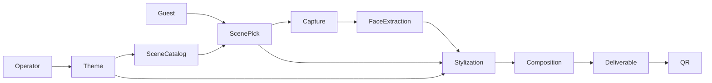

# Cabine IA — Project Definition

**Status:** Approved for MVP planning  
**Last updated:** 2026-05-28  
**Document type:** Product definition (not technical implementation)

This document describes what Cabine IA is, who it serves, how it behaves, and what is in scope for the MVP. Technical design and user stories should trace back to sections here—especially [§16 Locked product decisions](#16-locked-product-decisions-mvp).

---

## 1. Executive summary

**Cabine IA** is an AI-powered photobooth for live events. The **operator** sets the active **theme** (which includes a fixed set of scenes, e.g. three). Each **guest** picks a **scene** from on-screen examples **before** taking a photo. The system uses the capture **only to locate faces**, then produces a **cartoon-style portrait** in that theme and scene. Guests do not receive the original photo—they receive the stylized result, typically via **QR code download** on their phone.

Unlike a classic photobooth that prints or shares the raw capture, Cabine IA treats the camera image as **ephemeral input** for identity and expression, not as the deliverable.

---

## 2. Problem and opportunity

| Classic photobooth | Cabine IA |
|---|---|
| Output = same photo guests took | Output = themed cartoon avatar |
| Limited branding per event | Theme + scenes match event/campaign |
| Prints or generic filters | Distinct, shareable “character” art |

**Opportunity:** Events (corporate activations, weddings, festivals, retail pop-ups) want memorable, on-brand moments that guests **want to share** on social media, without operating a full creative studio on site.

---

## 3. Vision and positioning

**One-liner:** *“A photobooth that turns your face into a themed cartoon character—in seconds.”*

**Positioning:** Premium, playful, event-ready experience. The **operator** controls event branding via **theme** selection; **guests** choose their adventure via **scene** (with clear previews). Capture and takeaway stay simple and fast.

**Brand name note:** *Cabine* evokes photobooth (*cabine de fotos*); *IA* signals AI stylization. Working title is fine until marketing locks a public name.

---

## 4. Target users

### Primary: Event guest

- Wants a fun, fast souvenir
- Expects clear steps, minimal typing, phone-friendly download
- May be in a group (**1–4 faces** supported in MVP)

### Primary: On-site operator

- Sets up laptop + camera before the event
- Chooses **theme** for the session (theme bundles its scenes, e.g. 3 predefined scenes)
- Configures countdown timings and handles retries during the event
- Does **not** need to design art or write prompts—only pick from prebuilt theme packs

### Secondary: Event organizer / brand (buyer)

- Cares about theme match, throughput, and reliability
- Out of MVP: custom theme authoring, output watermarks; in MVP: pick from packaged themes

---

## 5. Core concepts (domain model)

### Theme

A **visual style system** for cartoon portraits: line weight, color palette, shading style, character proportions, and optional brand accents.

- **Selected by the operator** before or during the event—not by the guest in MVP.
- One active theme per session.
- Examples (illustrative): *Retro comic*, *Soft watercolor mascot*, *Bold flat vector corporate*.

### Scene

A **composition and narrative setting** within a theme: background environment, framing, props, and layout rules for where the stylized face(s) appear.

- Each theme ships with a **fixed set of predefined scenes** (MVP: **3 scenes per theme**).
- **Selected by the guest** before capture—not by the operator.
- Scenes share the theme’s visual style; they differ in **setting, mood, and composition**.
- Each scene includes:
  - **Display name** — short label on the picker (e.g. “Herói na praia”, “Noite na cidade”).
  - **Example image** — guest-facing preview; **authored beforehand** (static images generated and bundled per scene before the event—same pipeline as deliverables when possible).
  - **Predefined prompts** — internal generation instructions bound to the scene (guests never see raw prompt text; operators never edit at runtime).
  - **Composition rules** — safe zones, 4:5 output, optional prop layers (defined in the scene pack).

### Scene picker (guest UI)

A **pre-capture** step where guests see all scenes for the active theme as **cards or tiles**: example image + name (+ optional one-line tagline). Tapping a scene locks that choice for the upcoming capture. A clear **back** control returns to the picker without consuming a generation slot.

### Scene prompts

Author-defined text (and optional negative prompts / parameters) packaged with each scene. They describe environment, pose hints, lighting, and how the face should integrate into the scene. **Versioned with the theme pack**—not editable on the booth during the event.

### Capture

A short camera interaction: preview, countdown, one shot. Used for face detection, pose, and expression. **Not shown to the guest as final output** (optional: brief “processing” preview only).

### Deliverable

The final image file guests keep: composed scene + stylized face(s). Format: high-quality PNG or JPEG; **fixed aspect ratio 4:5** for all scenes in MVP. **No watermark or event branding** burned into the file in MVP.

### Session (event run)

Operator configuration (active **theme**, countdown settings) + per-guest **scene choice** + ephemeral file retention policy.

---

## 6. Guest experience (happy path)

UI copy in **Portuguese** for MVP (see §16).

1. **Attract** — Idle screen: e.g. “Faça seu retrato cartoon”.
2. **Start** — Guest taps “Começar” (or operator starts in assisted mode).
3. **Choose scene** — Guest sees **3 scene options**: **pre-generated example image + name** per scene; taps one to continue. Optional short tagline. Guest can go back and change scene before capture.
4. **Capture** — Guest taps **“Tirar foto”**; live preview with framing guide (supports **1–4 faces**); **configurable capture countdown** (e.g. 3–2–1); single shot. Short consent notice here or before countdown.
5. **Processing** — e.g. “Criando seu retrato [nome da cena]…”; target **under 30–45 seconds** perceived wait.
6. **Reveal** — Full-screen stylized result (not the raw photo).
7. **Takeaway** — QR code linking to a **time-limited download page**; guest scans and saves to camera roll.
8. **Done** — **Configurable post-finish countdown** on the result/QR screen (operator sets duration, e.g. 15–60s); timer visible until auto-reset to attract. Guest or operator can skip early (“Próximo” / tap to finish).

**Group behavior (MVP):** Support **1–4 faces** in frame; UI and composition should adapt layout by face count where possible. Graceful degradation if detection finds fewer faces than people present (retry prompt in Portuguese).

---

## 7. Operator experience

### Pre-event setup

- Connect camera (MVP: **single supported webcam path** on laptop).
- Choose **theme** from installed packs (confirms which **3 scenes** guests will see).
- Set **capture countdown** duration and **post-finish countdown** duration.
- **No branding/watermark** on deliverable in MVP.
- Test shot: operator runs one full cycle (each scene once) to validate lighting, examples, and generation quality.

### During event

- **Pause / resume** booth
- **Retake** last session without exposing previous guest’s QR
- **Skip** stuck generation (with friendly guest message)
- Optional **session counter**: number of successful deliverables

### Post-event

- Optional session log (counts, errors)—no long-term storage of guest photos unless organizer opts in (see §9).

---

## 8. Delivery channels (MVP vs later)

| Channel | MVP | Notes |
|---|---|---|
| **QR → mobile download page** | **Yes (primary)** | Laptop serves LAN URL; use event Wi‑Fi or hotspot so phones reach the host. |
| Email | Later | Poor UX at booth. |
| SMS / WhatsApp | Later | API, cost, consent, phone entry. |
| AirDrop | Optional macOS nicety | Not reliable for mixed Android/iOS crowds. |
| Print | Out of scope MVP | Product extension later. |

**QR link lifetime:** Recommend **15–60 minutes** per deliverable URL; files deleted after expiry unless extended retention is enabled.

**Party / home fallback:** Full-screen result so guests can screenshot; AirDrop on iOS-only groups. Document in operator runbook.

---

## 9. Privacy and data handling

- **Purpose limitation:** Camera frames used only for face detection and stylization during the session.
- **No guest-facing raw photo** by default; operator test mode may show raw for calibration (operator-only).
- **Retention:** Ephemeral storage on laptop; auto-delete captures and intermediates after successful delivery or after N hours.
- **Consent:** Short on-screen notice before capture (likeness processing for cartoon generation and digital delivery). Party pilot: one friendly Portuguese line is enough; formal legal copy is a later artifact.
- **Children / schools:** Organizer responsibility in future deployments.

---

## 10. Functional requirements

### Must have (MVP)

- Fullscreen kiosk UI on **laptop + camera**
- Operator panel: select **theme** only (theme includes its 3 scenes)
- Guest flow: **scene picker (with pre-generated examples)** → **“Tirar foto”** → capture → process → reveal → **QR download**
- Face detection (**1–4 faces**) with graceful failure and retry UX in Portuguese
- Stylization consistent with active **theme**; composition into guest-selected **scene**
- Local serving of download links
- Operator: retake, pause, skip stuck job, basic error recovery
- **Configurable countdowns:** capture (before shutter) and post-finish (before idle reset)
- **UI language:** Portuguese first
- **Deliverable:** 4:5, no branding on file

### Should have (MVP+)

- Session stats for operator
- Offline-tolerant queue if generation API blips

### Won’t have (MVP)

- Guest-selected **themes**
- Custom theme or prompt editor on the booth
- Watermark / event logo on deliverable
- Print fulfillment
- Account system / cloud gallery for all guests
- Multi-booth cloud dashboard

---

## 11. Non-functional requirements

| Area | MVP target |
|---|---|
| **Throughput** | ~40–80 guests/hour at events (depends on generation latency); ~10–20/hour acceptable for personal party pilot |
| **Reliability** | Retry once on generation failure; then operator skip with guest-friendly message |
| **Hardware** | Modern laptop, 1080p webcam, good lighting; backup USB camera |
| **Network** | Guest phones must reach download host—Wi‑Fi or hotspot playbook required |
| **Accessibility** | Large tap targets, high contrast UI; optional audio countdown |

---

## 12. Content pipeline (themes and scenes)

**Theme pack** (versioned assets + config):

- Style reference prompts / model presets
- Color and typography rules for UI chrome (optional)
- Face crop and head-size ratio guidelines

**Scene pack** (per theme, **3 scenes** in MVP):

- **Example image** — static, pre-generated, readable at arm’s length on the booth display
- **Display name** and optional tagline (Portuguese)
- **Predefined prompts** — not shown to guests or operators at runtime
- Background / composition template
- Safe zones for **1–4 face** layouts
- **Output: 4:5**; result screen leaves safe margin for QR overlay (QR not burned into deliverable file)

**Authoring workflow:** Build and QA theme packs **before** the event. Operator selects theme at runtime. Guests select scene. Author generates example images using the same prompts/model intended for live generation.

**Versioning:** Log theme id, scene id, and prompt revision per deliverable for support.

---

## 13. Success metrics (MVP validation)

- **Completion rate:** % of started sessions that reach QR download (proxy: download page hits / starts)
- **Time to deliverable:** median under 45s processing (excluding posing)
- **Retake rate:** % requiring second capture
- **Operator burden:** setup under 15 minutes; <5% sessions need operator intervention at events
- **Qualitative:** guests share results voluntarily

**Party pilot bar:** Most guests finish in under 2 minutes end-to-end; at least 2 of 3 scenes produce shareable results; no mid-party reboot required.

---

## 14. Risks and mitigations (product level)

| Risk | Mitigation |
|---|---|
| Slow or failed AI generation | Clear UX, retry, operator skip; cap concurrent jobs |
| Poor lighting → bad faces | Framing guide + operator test shot; fun retry copy |
| Phones can’t open QR URL | Hotspot/Wi‑Fi playbook; screenshot fallback |
| Example ≠ delivery | Pre-generate examples with same prompts/model; QA all scenes |
| Multi-face (1–4) quality | Dry-run 1, 2, and 4 faces; layout rules per face count |
| Privacy concerns | No raw photo delivery; short retention; consent line |

---

## 15. Roadmap sketch (product only)

- **v0 (MVP):** Laptop kiosk, 1 theme, 3 guest-selectable scenes, pre-generated examples, 1–4 faces, 4:5, Portuguese UI, QR delivery, configurable countdowns, operator picks theme
- **v1:** Extra themes/scenes, session analytics, optional watermark for commercial events
- **v2:** SMS/WhatsApp delivery, print partner
- **v3:** Custom theme commissioning for agencies

---

## 16. Locked product decisions (MVP)

| Decision | Choice |
|---|---|
| **Max faces** | **1–4** per capture |
| **Deliverable aspect ratio** | **4:5** (all scenes) |
| **Branding on output** | **None** (no watermark/event logo in MVP) |
| **UI language** | **Portuguese first** (i18n later) |
| **Scene examples** | **Static images**, generated and bundled **before** the event (not live-generated at picker time) |
| **After scene pick** | Explicit **“Tirar foto”** before capture countdown starts |
| **Capture countdown** | **Configurable** by operator (duration before shutter) |
| **Post-finish countdown** | **Configurable** by operator (duration on result/QR screen before auto-return to attract) |

---

## 17. First deployment: personal party pilot

Recommended first real-world test: **personal party** on a laptop with webcam.

**Keep from MVP:** operator theme, guest scene picker, 1–4 faces, 4:5, Portuguese UI, QR + screenshot fallback, configurable countdowns, pre-generated scene examples.

**Relax for party night:**

| Full MVP | Party pilot |
|---|---|
| Formal legal copy | One friendly Portuguese consent line |
| Session analytics export | Optional; handwritten notes OK |
| High throughput | 10–20 guests/hour is fine |

**Pre-party checklist:**

- 1 theme, 3 scenes, each with **example image + prompts** QA’d
- Dry-run **1, 2, and 4 faces**; verify 4:5 output
- Set capture and post-finish countdown durations
- Test QR from a guest phone on the same Wi‑Fi or laptop hotspot
- One light facing guests; avoid window backlight

**After party:** Note popular scene, retake rate, QR failures, weak outputs—feeds v1 backlog.

---

## 18. Related documents (planned)

| Document | Purpose |
|---|---|
| `MVP_EPIC_ROADMAP.md` | Vertical MVP epics for implementation and user stories |
| `THEME_PACK_SPEC.md` | How to author and package themes and scenes |
| `OPERATOR_RUNBOOK.md` | Camera, Wi‑Fi/hotspot, lighting, troubleshooting |
| `LEGAL_CONSENT_COPY.md` | Formal capture-screen text (when needed) |

Technical architecture and user stories are **out of scope** for this file; they should reference §10 and §16.

---

## Document history

| Date | Change |
|---|---|
| 2026-05-28 | Initial definition; MVP decisions locked in §16 |
