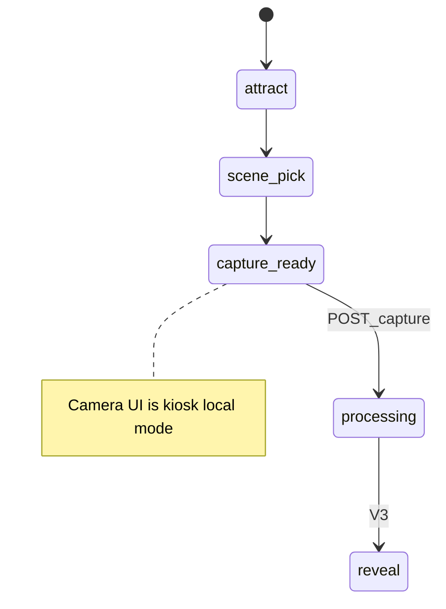

# V2 — Capture slice

**Status:** Complete  
**Branch:** `feature/v2-capture`  
**Last updated:** 2026-06-16

**Sources:** [PROJECT_DEFINITION.md](../PROJECT_DEFINITION.md) §6 step 4, §9 consent, §10 face detection, §16 max faces + capture countdown · [ARCHITECTURE.md](../ARCHITECTURE.md) §5–6, §9 · [MVP_EPIC_ROADMAP.md](../MVP_EPIC_ROADMAP.md) V2

---

## User outcome

Guest taps **Tirar foto** → consent line → live preview with framing guide → **capture countdown** → single shot → face detection accepts crops matching the **operator-configured expected face count** (1–4) or shows **PT retry**; on success API stores ephemeral crops under `api/data/tmp/` and booth enters **`processing`** with “Criando seu retrato…” (generation stubbed until V3).

**Demo:** `npm run dev` → complete V1 flow to capture-ready → real webcam capture → `curl http://127.0.0.1:3000/booth` shows `phase: "processing"`; tmp files exist under `api/data/tmp/{sessionId}/`.

---

## Slice boundary

### In scope

- Phases: `capture_ready` → `processing` (server); camera/consent/countdown as **kiosk UI sub-mode** while phase stays `capture_ready`
- `POST /sessions/current/capture` — multipart JPEG crops (1–4); writes tmp files; transitions session to `processing`
- `CaptureStorageService` under `api/data/tmp/{sessionId}/`
- `BoothConfig.captureCountdownSeconds` (default `3`) and `expectedFaceCount` (default `1`, range 1–4) exposed in `GET /booth.config`
- Kiosk: enable **Tirar foto**; camera preview; consent (PT); countdown from config; face detection (kiosk-only); crop upload; PT retry when detected count ≠ expected or is 0; `ProcessingScreen`
- Extend `OPEN_SESSION_PHASES` to include `processing`

### Deferred to V3+

- AI generation, reveal, deliverables (V3)
- `GET /sessions/current` poll during processing (V3)
- QR / R2 / session reset to attract (V4)
- Operator pause, retake, skip (V5)
- Operator face-count + countdown config UI (V5)
- Server `capturing` phase (see deviation below)

Kiosk must **not** advance booth phases locally — only send commands and read `phase` from the API. Camera UI is a **sub-mode** on `capture_ready`, not a separate booth phase.

### Deviation from architecture

[ARCHITECTURE.md](../ARCHITECTURE.md) §5 shows `capture_ready → capturing → processing`. V2 uses a **single** `POST /sessions/current/capture` and keeps the server on `capture_ready` until crops are accepted. The countdown/camera flow runs as kiosk-only UI; server transition is `capture_ready → processing` only.



---

## Architecture decisions

| Topic | Choice |
|-------|--------|
| Server phases (V2) | `capture_ready → processing` only; camera flow is kiosk UI sub-mode on `capture_ready` |
| Face detection | `@mediapipe/tasks-vision` in kiosk only (per architecture §4); mocked in Vitest |
| Capture payload | `multipart/form-data`: `crops` (1–4 JPEG files) + optional `faceCount` metadata |
| Tmp storage | `api/data/tmp/{sessionId}/crop-{n}.jpg`; gitignored via existing `api/data/` rule |
| Expected face count | `BoothConfig.expectedFaceCount` default `1`, range 1–4; operator UI in V5 |
| Countdown | `BoothConfig.captureCountdownSeconds` default `3`; operator UI in V5 |
| Validation | Kiosk primary (retry UX); validate detected count against `expectedFaceCount`; API rejects 0 or >4 crops with **400** |
| Privacy | No raw photo in API responses; tmp paths never exposed to kiosk |
| Phase ownership | Unchanged from V1: `GET /booth.phase` = `currentSession?.phase ?? 'attract'` |

---

## API contract

All routes bind `127.0.0.1` only in dev. Base URL: `http://127.0.0.1:3000`. V1 routes unchanged.

### Guest routes (public)

| Route | Transition | Notes |
|-------|------------|-------|
| `POST /sessions/current/capture` | `capture_ready` → `processing` | Multipart: 1–4 JPEG crops; writes tmp files |
| `POST /sessions/current/back` | `capture_ready` → `scene_pick` | Unchanged; disabled in kiosk while capture UI active |

**Errors:** 409 invalid phase; 400 bad crop count; 404 no open session.

### Booth snapshot (V2)

```json
{
  "phase": "processing",
  "event": { "id": "…", "name": "Festa da Ana" },
  "theme": { "id": "stub-a", "name": "Festa Cartoon" },
  "scenes": [
    {
      "id": "beach",
      "name": "Praia",
      "tagline": null,
      "exampleUrl": "/themes/stub-a/scenes/beach/example"
    }
  ],
  "config": { "captureCountdownSeconds": 3, "expectedFaceCount": 2 },
  "session": { "id": "…", "sceneId": "beach", "sceneName": "Praia" }
}
```

| Field | Notes |
|-------|-------|
| `phase` | `capture_ready` or `processing` during V2 guest flow |
| `config.captureCountdownSeconds` | From `BoothConfig`; used by kiosk countdown |
| `config.expectedFaceCount` | From `BoothConfig`; kiosk validates detected faces against this (1–4) |
| `scenes` | Populated when `phase >= scene_pick` (V1 behavior) |
| `session.sceneName` | Set when `phase` is `capture_ready` or `processing` |
| tmp paths | **Never** in API response |

---

## Target folder structure

```
cabine-ia/
  api/
    prisma/schema.prisma          # + captureCountdownSeconds, expectedFaceCount
    src/
      capture/
        capture.module.ts
        capture-storage.service.ts
        capture-storage.service.spec.ts
      sessions/
        dto/submit-capture.dto.ts   # validation helpers
      booth/
      sessions/
    data/
      tmp/                          # ephemeral crops (gitignored)
  kiosk/
    src/
      camera/
        useCamera.ts
        useFaceDetection.ts
        extractFaceCrops.ts
      screens/
        CaptureReadyScreen.tsx      # ready + inline capture mode
        ProcessingScreen.tsx
      api/sessionClient.ts          # + submitCapture()
      routing/PhaseRouter.tsx
  docs/
    epics/V2_CAPTURE.md
```

---

## Tasks

Each task: **Red → Green → Refactor**. Update status as work completes.

### Phase A — Setup

| ID | Task | Status |
|----|------|--------|
| V2-00 | Create branch `feature/v2-capture` | done |
| V2-01 | Create this epic spec; link from `MVP_EPIC_ROADMAP.md` | done |
| V2-02 | Confirm `api/data/` in `.gitignore` covers `tmp/` | done |

### Phase B — Booth config

| ID | Task | TDD focus | Status |
|----|------|-----------|--------|
| V2-10 | Prisma: `captureCountdownSeconds Int @default(3)` and `expectedFaceCount Int @default(1)` on `BoothConfig`; migration | Migration applies in test DB | done |
| V2-11 | `BoothSnapshot.config` includes `captureCountdownSeconds` and `expectedFaceCount` in `booth.service.ts` | Integration: GET /booth includes config | done |

### Phase C — FSM + capture route

| ID | Task | TDD focus | Status |
|----|------|-----------|--------|
| V2-20 | `SessionFsmService`: `assertCanSubmitCapture`, `nextPhaseAfterCapture` → `processing` | Unit: capture_ready only; rejects other phases | done |
| V2-21 | Extend `SESSION_PHASES`, `OPEN_SESSION_PHASES`, `BoothPhase`, kiosk `booth.ts` with `processing` | Typecheck + unit | done |
| V2-22 | `CaptureStorageService`: write crops to `api/data/tmp/{sessionId}/` | Unit: files on disk; correct paths | done |
| V2-23 | `POST /sessions/current/capture` (multipart) in controller + service | Integration: phase `processing` + files saved | done |
| V2-24 | Reject invalid capture: 400 (0 or >4 crops), 409 (wrong phase) | Integration | done |

#### Phase C — Implementation notes

**V2 session phases** (stored on `Session.phase`):

| Phase | Meaning |
|-------|---------|
| `scene_pick` | V1 — guest started; no scene chosen |
| `capture_ready` | V1 — scene locked; guest may capture (kiosk camera sub-mode) |
| `processing` | V2 — crops accepted; awaiting generation (V3) |

**FSM transitions** (`SessionFsmService` — pure, no I/O):

| Command | From | To | Side effects |
|---------|------|-----|--------------|
| `submitCapture(crops)` | `capture_ready` | `processing` | Write tmp crops via `CaptureStorageService` |
| `back` | `capture_ready` | `scene_pick` | Clear `sceneId` (V1; unchanged) |

V1 transitions (`start`, `selectScene`, `back`) unchanged.

**Phase D handoff:** `GET /booth` returns `config.captureCountdownSeconds` and `phase: processing` after successful capture.

### Phase D — Booth snapshot + chain test

| ID | Task | TDD focus | Status |
|----|------|-----------|--------|
| V2-30 | `GET /booth` snapshot for `processing` phase | Integration: session + sceneName + config | done |
| V2-31 | E2E chain: scene pick → capture (multipart fixture) → `processing` | supertest chain | done |

### Phase E — Kiosk camera + face detection

| ID | Task | TDD focus | Status |
|----|------|-----------|--------|
| V2-40 | Add `@mediapipe/tasks-vision` to kiosk `package.json` | Install + typecheck | done |
| V2-41 | `useCamera` hook (`getUserMedia`) | Vitest: mock media stream | done |
| V2-42 | `useFaceDetection` + `extractFaceCrops` | Vitest: mock detector; 1–4 crop output | done |

### Phase F — Kiosk guest flow

| ID | Task | TDD focus | Status |
|----|------|-----------|--------|
| V2-50 | Extend `booth.ts` types + `sessionClient.submitCapture()` (FormData) | Vitest mocks | done |
| V2-51 | `CaptureReadyScreen`: enable Tirar foto; inline capture mode (consent → preview → countdown → detect → upload or PT retry) | RTL: flow + retry copy | done |
| V2-52 | `ProcessingScreen`: “Criando seu retrato…” | RTL: renders message | done |
| V2-53 | `PhaseRouter`: `processing` case; wire handlers in `App.tsx` | Vitest routing | done |

#### Phase F — Implementation notes

- **`CaptureReadyScreen`** has two UI modes: **ready** (scene name + Tirar foto + Voltar) and **capturing** (consent, preview, countdown, shot). Booth phase stays `capture_ready` until `submitCapture` succeeds.
- **`PhaseRouter`** maps `processing` → `ProcessingScreen`; no client-side booth FSM.
- **Retry:** face validation failures stay on capture UI; no API call until 1–4 valid crops.
- **Voltar** disabled while capture UI active to avoid inconsistent state.

### Phase G — Sign-off

| ID | Task | Status |
|----|------|--------|
| V2-80 | Manual demo script (see below) | done |
| V2-81 | Epic DoD checklist complete | done |

---

## PT copy

| Moment | Copy |
|--------|------|
| Consent | “Usamos sua foto só para criar o retrato cartoon e entregar o arquivo digital.” |
| 0 faces | “Não encontramos rostos. Tente de novo.” |
| Count mismatch | “Encontramos {n} rosto(s). Esperávamos {expected}. Ajuste o enquadramento.” |
| Too many faces (>4) | “Máximo de 4 pessoas. Ajuste o enquadramento.” |
| Processing | “Criando seu retrato…” |

---

## Environment variables

No new env vars for V2. Existing V1 vars unchanged (`OPERATOR_PIN`, `JWT_SECRET`, `DATABASE_URL`).

---

## Manual demo script

1. From repo root: `npm run dev`
2. Operator: long-press hidden corner → login → activate event → pick theme; set expected face count if not default (V5 UI; V2 uses booth config default)
3. Guest: tap **Começar** → pick a scene → see **Tirar foto** with scene name
4. Tap **Tirar foto** → accept consent → countdown → capture with expected number of faces in frame
5. See **Criando seu retrato…** processing screen
6. `curl http://127.0.0.1:3000/booth` → expect `phase: "processing"` and `session.sceneId`
7. Check `api/data/tmp/{sessionId}/` has crop JPEG files
8. Retry path: cover camera or leave frame empty → PT error → retry without leaving session

---

## Definition of Done

- [x] Failing test first for each behavior task; full suite passes
- [x] Demoable: webcam capture path via `npm run dev` through processing screen
- [x] Traces to product §6 step 4, §9 consent, §10 face detection, §16 max faces + countdown
- [x] API owns phase FSM; kiosk has capture UI sub-mode only (no client FSM for booth phases)
- [x] No guest raw photo in API responses; tmp paths server-only
- [x] No api↔kiosk cross-imports; face detection lib in kiosk only
- [x] PT copy on consent, retry, and processing screens
- [x] Deviation from architecture `capturing` server phase documented (this spec)

---

## Document history

| Date | Change |
|------|--------|
| 2026-06-16 | Initial V2 epic spec |
| 2026-06-16 | Configurable expected face count (1–4) on booth config |
| 2026-06-17 | Phases A–G complete: capture route, tmp storage, kiosk camera flow, processing screen |
